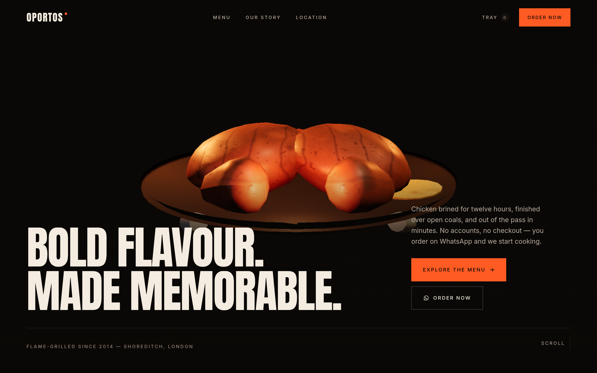

# OPORTOS

A cinematic, 3D restaurant site for a fictional flame-grilled kitchen in Shoreditch,
London. Built as a portfolio piece: original art direction, a procedural WebGL hero,
scroll-driven storytelling, and ordering that ends in a WhatsApp message rather than a
checkout.



## Run it

```bash
npm install
npm run dev          # http://localhost:3000
```

Production build and the visual-verification workflow:

```bash
npm run build
npm start            # http://localhost:3000

npm run preview      # build + serve on :3100 (used by the scripts below)
npm run shoot        # drive the site in Chromium, write PNGs to /screenshots
npm run check:flows  # tray, dish detail, keyboard order, mobile menu
npm run check:links  # every wa.me link: number, encoding, target, rel
npm run audit:a11y   # axe-core, WCAG 2.1 A/AA, all five routes
npm run measure      # initial vs. lazily-loaded JS payload
npm run lint
npm run typecheck
```

## What's here

| Area | Notes |
| --- | --- |
| Hero | Procedural 3D dish, scroll-driven camera, pointer parallax, masked line reveals |
| Our Flavour | Editorial statement, scroll-depth ingredient composition, velocity-reactive marquee |
| Signature dishes | Sticky scroll sequence over 5 dishes; the 3D scene swaps models, the wash and copy follow |
| Immersive | Four-layer parallax heat bloom, no product, one line of copy |
| Menu | Five categories, editorial rows, per-dish WhatsApp order + add-to-tray, sticky scroll-spy |
| Story / Location | Chapters, quote, drawn map schematic (no third-party embed) |
| Ordering | `wa.me` deep links only — no backend, no accounts, no payment |

## Stack

Next.js 16 (App Router) · TypeScript · Tailwind v4 · React Three Fiber + drei + three ·
Framer Motion · GSAP (ScrollTrigger) · Lenis.

## Assets

There are **no image or model files in this repository.** Outbound network access in the
environment this was built in is restricted to the npm registry, so no photography or GLB
could be sourced. Every visual is generated:

- **3D:** displaced primitive geometry with a custom fbm char/sear shader patched into
  `MeshPhysicalMaterial` (`components/three/utils/`). Five dishes, ~0 KB of binary assets.
- **Fallback:** a duotone SVG "print" of each dish (`components/three/fallback/DishArt.tsx`)
  for devices without WebGL, or where the capability probe says the GPU shouldn't be asked.
- **Texture/grain:** inline SVG `feTurbulence`, no image requests.
- **Fonts:** self-hosted via `@fontsource`, so the build never needs network access.

## Structure

```
app/            routes: /, /menu, /story, /contact, not-found
components/
  three/        canvas host, camera rig, lighting, models/, fallback/, utils/
  motion/       reveals, parallax, smooth scroll
  menu/         tray provider + drawer, menu rows, dish detail
  navigation/   nav, mobile overlay, footer
  sections/     homepage sections
  ui/           buttons, marquee, headers, heat scale
config/site.ts  brand, address, hours — and the single WhatsApp number
data/menu.ts    dishes, categories, palettes
lib/            whatsapp message builders, frame store, hooks, tray store
scripts/        verification tooling (see above)
```

## Accessibility

Semantic landmarks, a skip link, visible focus rings, labelled controls, Escape-dismissable
dialogs with focus restore, and a real reduced-motion path (the 3D scene freezes its idle
motion, camera rig and pointer response rather than merely animating faster).

`npm run audit:a11y` reports one remaining contrast finding per page: the oversized
`OPORTOS` watermark in the footer, which is `aria-hidden` decoration duplicating the
full-contrast wordmark in the nav — WCAG 1.4.3 exempts pure decoration.
